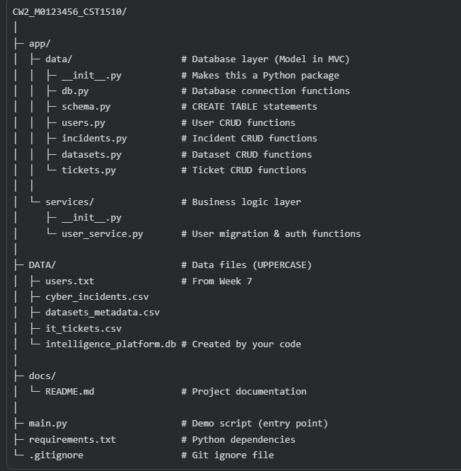
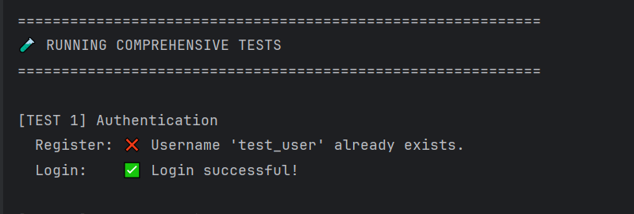
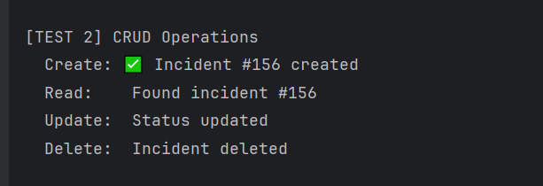
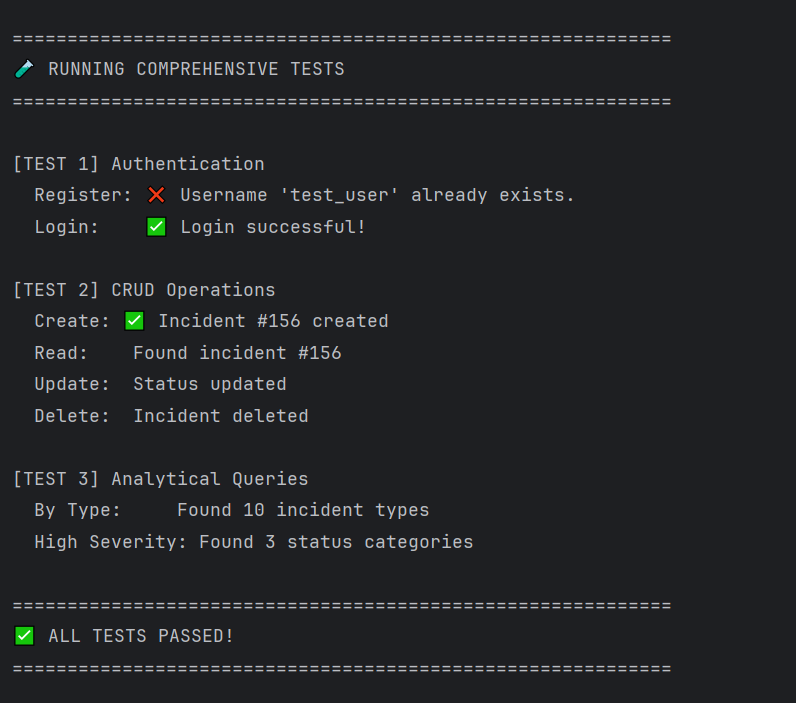

# Week 8 Week 8: Data Pipeline & CRUD (SQL)

Overview
--------
This Python program initializes and populates an SQLite database for a Cyber Security Intelligence Platform. It manages user accounts, loads CSV data for cyber incidents, IT tickets, and datasets, and performs comprehensive CRUD operations. The system includes automated tests to validate all core functionality.

Features
--------
1. Database Setup
   - Creates tables: users, cyber_incidents, it_tickets, datasets_metadata.
   - Migrates users from an external file.
   - Loads CSV data with column renaming for schema consistency.

2. CSV Data Loading
   - Accepts cyber_incidents.csv, it_tickets.csv, datasets_metadata.csv.
   - Automatically skips missing or empty files.
   - Standardizes column names.

3. User Management
   - Register users with roles.
   - Authenticate logins.

4. Incident Management
   - Insert, update, delete, and retrieve incidents.
   - Group incidents by type.
   - Filter high-severity incidents by status.

5. Testing
   - Automated tests validate:
     - User registration
     - User login
     - Incident creation
     - Incident update
     - Incident deletion
   - Prints detailed results to the console.

Project Structure
-----------------

Setup Instructions
------------------
1. Install dependencies:
   pip install pandas

2. Prepare CSV files:
   - Place cyber_incidents.csv, it_tickets.csv, datasets_metadata.csv in the DATA/ directory.

3. Run the program:
   python main.py

   This will:
   - Create all required tables
   - Import users from file
   - Load CSV data
   - Run automated tests
   - Create example users and incidents

Screenshots
-----------

### 1. Database Setup Output

### 2. User Registration & Login

### 3. Incident Creation & Retrieval

### 4. Test Results

### 5. Notes

-----
- The SQLite database `intelligence_platform.db` is created in the `data/` directory
- All passwords in `users.txt` must be pre-hashed with bcrypt
- CSV files must contain valid headers matching the expected schema
- Test users and incidents are temporary and used only for validation
- All CRUD operations include error handling and return status codes